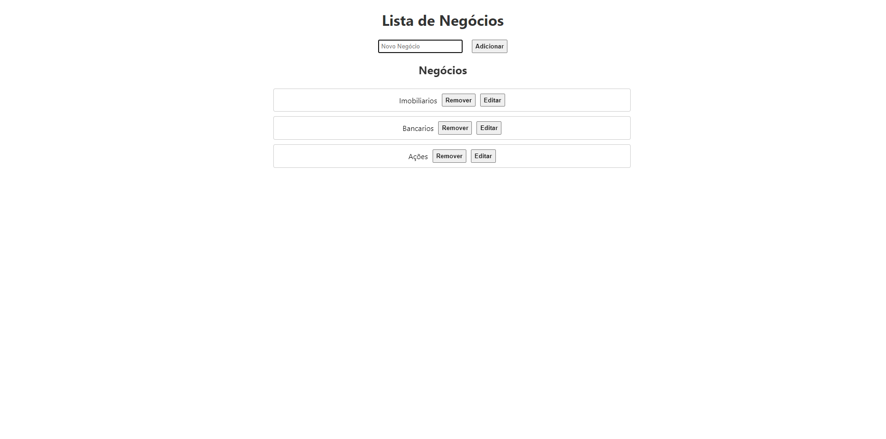

# Lista de Negócios

## Tema Recebido
O projeto consiste em uma aplicação web que gerencia uma lista de negócios utilizando a biblioteca React. A aplicação permite adicionar, editar e remover itens da lista de negócios. A estrutura do projeto segue os conceitos de componentes, props e hooks.

## Estrutura do Projeto
A estrutura do projeto está organizada da seguinte forma:

### Componentes

- **App.js**: 
  O componente principal que gerencia o estado da aplicação e renderiza os componentes filhos `NegociosForm` e `NegociosList`.

- **NegociosList.jsx**: 
  Componente responsável por exibir a lista de negócios. Recebe a lista de negócios como props e permite a edição e remoção dos itens.

- **NegociosForm.jsx**: 
  Formulário para adicionar novos negócios. Utiliza hooks para gerenciar o estado do formulário e passa os dados para o componente `App`.

### Funcionalidades

- **Adicionar Negócios**: 
  Permite adicionar novos itens à lista de negócios através de um formulário.

- **Editar Negócios**: 
  Permite editar os itens existentes da lista.

- **Remover Negócios**: 
  Permite remover itens da lista de negócios.

## Instruções de Instalação e Uso

### Pré-requisitos
- Node.js instalado 
- npm

### Instalação

1. Clone o repositório para o seu ambiente local:
   - No git bash
   git clone <URL_DO_REPOSITORIO>

### Foto da tela da aplicação

